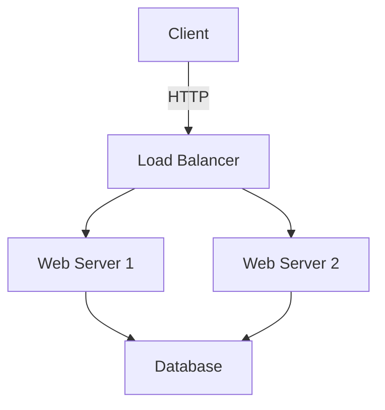
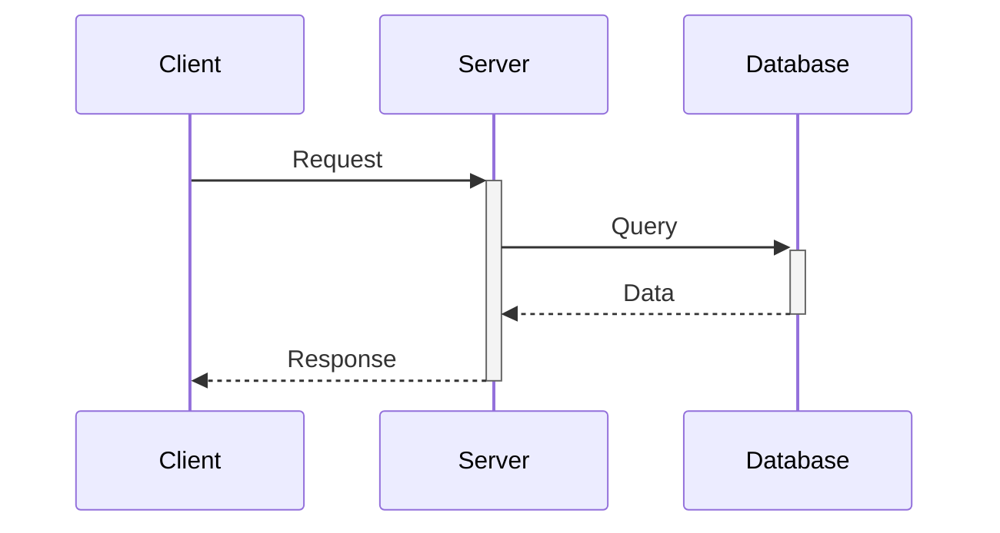
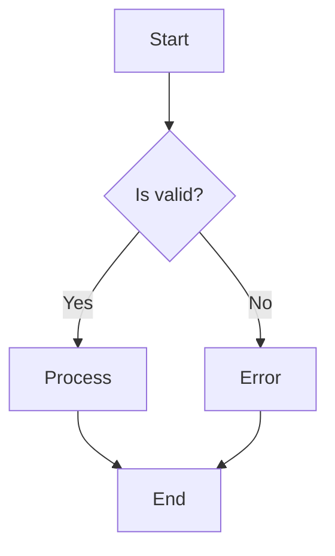

# Writing Tips

## Use Active Voice

✅ Good: "The system sends a notification"  
❌ Bad: "A notification is sent by the system"

## Be Concise

✅ Good: "Click Save to save changes"  
❌ Bad: "In order to save your changes, you should click on the Save button"

## Use Examples

✅ Good:
```yaml
# Set the timeout in seconds:
timeout: 30
```

❌ Bad:
"Configure the timeout parameter appropriately"

## Break Down Complexity

✅ Good:
```
To deploy:
1. Build the image
2. Push to registry
3. Update deployment
4. Verify rollout
```

❌ Bad:
"Deploy by building and pushing the image to the registry, then update the deployment and verify the rollout succeeded"

---

# Common Mistakes

1. **Assuming knowledge** - Define terms, explain context
2. **Outdated docs** - Keep in sync with code
3. **Missing examples** - Always include examples
4. **No visuals** - Use diagrams for complex concepts
5. **Poor structure** - Use headings and sections
6. **Passive voice** - Use active voice
7. **Too much jargon** - Write for your audience
8. **No version info** - Date docs, note versions
9. **Missing error cases** - Document what can go wrong
10. **No maintenance** - Update regularly

---

# Best Practices

1. **Write for your audience** - Match their knowledge level
2. **Start with why** - Explain the purpose
3. **Show, don't just tell** - Use examples
4. **Be consistent** - Terminology, style, structure
5. **Test your docs** - Can someone follow them?
6. **Version your docs** - Track with code versions
7. **Use templates** - Consistency across docs
8. **Link related docs** - Help readers find more info
9. **Update with code** - Docs are part of the code
10. **Review regularly** - Quarterly doc review

---

# Audience Types

## Developer
- Focus on implementation details
- Include code examples
- Technical terminology is okay
- Show how, not just what

## DevOps/Operations
- Focus on deployment and maintenance
- Include configuration examples
- Emphasize monitoring and troubleshooting
- Provide runbooks

## Manager/Stakeholder
- High-level overview
- Business impact
- Minimal technical jargon
- Focus on outcomes

## End User
- Simple, clear language
- Step-by-step instructions
- Visual aids (screenshots, videos)
- FAQ section

---

# Visual Aids

## Architecture Diagram (Mermaid)


## Sequence Diagram


## Flowchart


## Code Blocks
```python
def calculate_total(items: List[Item]) -> Decimal:
    """Calculate total price of items."""
    return sum(item.price for item in items)
```

## Tables
| Parameter | Type | Default | Description |
|-----------|------|---------|-------------|
| timeout   | int | 30 | Request timeout in seconds |
| retries   | int | 3  | Number of retry attempts |
